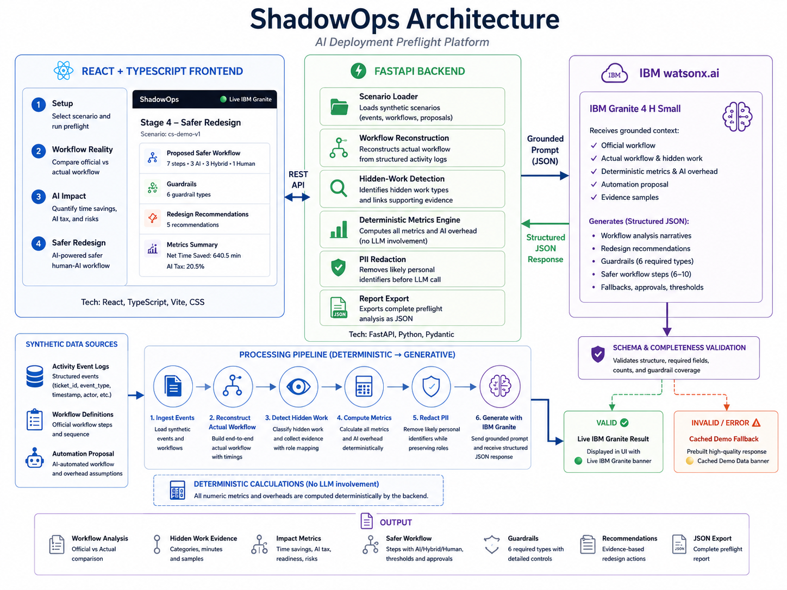

# ShadowOps

**AI Deployment Preflight Platform**  
IBM July Wildcard Hackathon — *Build Intelligent Systems for the Future of Work*

> **Reveal hidden work. Measure the AI Tax. Design safer human–AI workflows.**

ShadowOps helps teams evaluate an AI automation proposal **before deployment**. It reconstructs the real workflow from activity logs, compares it with the documented process, calculates deterministic impact metrics, and uses IBM Granite to generate a safer hybrid redesign with approvals, guardrails, confidence thresholds, and fallback procedures.

## Try ShadowOps

- **Live demo:** [https://shadowops-api.onrender.com](https://shadowops-api.onrender.com)
- **GitHub:** [https://github.com/unity-darshthakkar/ShadowOps](https://github.com/unity-darshthakkar/ShadowOps)

> The app runs on Render’s free tier, so the first visit may take a short time while the service wakes up.

---

## At a Glance

| | |
|---|---|
| **Problem** | AI projects often automate the documented workflow while missing hidden human work and new operational overhead. |
| **Solution** | ShadowOps reconstructs the actual workflow, calculates the AI Tax, and creates a safer human–AI redesign. |
| **Core idea** | Deterministic metrics first; grounded IBM Granite reasoning second. |
| **Demo result** | 5 official steps became 14 actual step types, revealing 20.1% hidden work and a 20.5% AI Tax. |
| **IBM technology** | IBM Bob, IBM watsonx.ai, IBM Granite 4 H Small |
| **Verification** | 60 backend tests, TypeScript validation, and a successful production build |

---

## The Problem

Organizations usually automate the workflow shown in process documents. The real workflow often contains additional work that management does not see:

- manual status checks
- follow-ups
- context reconstruction
- duplicate entry
- rework
- exception handling
- escalation
- reconciliation across systems

Automation also creates new costs: reviewing AI output, correcting errors, handling exceptions, maintaining integrations, and recovering from failures.

Ignoring this work can make an AI project look more valuable than it really is.

---

## How ShadowOps Works

### 1. Setup

Select a workflow scenario and run the preflight.

### 2. Workflow Reality

ShadowOps reconstructs the actual workflow from structured events and compares it with the official process. Each hidden-work finding is linked to supporting evidence.

### 3. AI Impact

The deterministic metrics engine calculates:

- hidden-work ratio
- gross time saved
- review overhead
- correction overhead
- exception overhead
- maintenance overhead
- failure-recovery overhead
- AI Tax
- net time saved
- burden concentration
- automation readiness
- skill-loss risk

### 4. Safer Redesign

IBM Granite receives grounded workflow evidence and produces:

- a safer AI, human, and hybrid workflow
- approval requirements
- confidence thresholds
- exception routing
- manual fallbacks
- skill-preservation controls
- audit-trail guardrails
- evidence-based recommendations

The full result can be exported as JSON.

---

## Demo Scenario

The included customer-support scenario contains:

- **5** official workflow steps
- **46** synthetic events across 5 tickets
- **14** actual workflow step types
- **19** hidden-work events
- **8** hidden-work categories

Example outcome:

| Metric | Result |
|---|---:|
| Hidden Work Ratio | 20.1% |
| Burden Concentration | 61% |
| Gross Time Saved | 805.7 min |
| AI Overhead | 165.2 min |
| AI Tax | 20.5% |
| Net Time Saved | 640.5 min |

All numerical results are calculated deterministically by the backend.

---

## Why It Is Different

Most automation tools ask:

> What can the AI automate?

ShadowOps asks:

> What work did the automation proposal miss, what new burden will it create, and what controls are required?

The language model **does not calculate business metrics**. The backend computes the evidence and numbers first. IBM Granite then interprets those grounded results and proposes a safer redesign.

---

## Architecture



```text
Synthetic activity logs
        ↓
Workflow reconstruction
        ↓
Hidden-work detection
        ↓
Deterministic metrics and AI Tax
        ↓
PII redaction
        ↓
IBM Granite through watsonx.ai
        ↓
Schema and completeness validation
        ├── Valid → Live Granite result
        └── Invalid/unavailable → Cached fallback
```

### Technology Stack

- **Frontend:** React, TypeScript, Vite, CSS
- **Backend:** Python, FastAPI, Pydantic
- **AI:** IBM watsonx.ai, IBM Granite 4 H Small
- **Development:** IBM Bob, GitHub, Docker
- **Testing:** pytest, TypeScript compiler, Vite production build
- **Hosting:** Render

---

## IBM Granite Integration

The grounded prompt includes:

- official workflow
- reconstructed actual workflow
- hidden-work categories and event evidence
- deterministic metrics
- AI-overhead assumptions
- proposed automation workflow
- strict JSON output requirements

Live output is shown only after schema and completeness validation. ShadowOps requires:

- 5–8 recommendations
- all 6 required guardrail types
- 6–10 safer workflow steps
- fallbacks for AI and hybrid steps
- approval for hybrid steps
- valid confidence thresholds
- complete workflow coverage

If IBM authentication, generation, parsing, or validation fails, the app automatically uses a cached demonstration response.

---

## IBM Bob Usage

IBM Bob was the **primary development tool** for ShadowOps.

It was used to:

- plan the architecture
- scaffold the FastAPI and React application
- define API routes and Pydantic schemas
- implement workflow reconstruction
- implement deterministic metric calculations
- build the four-stage interface
- integrate IBM Granite through watsonx.ai
- add structured-output and completeness validation
- build and expand the backend test suite
- improve setup and Windows documentation

A secondary coding assistant was used for targeted QA and frontend polish.

---

## Safety and Responsible AI

- synthetic demonstration data only
- no demographic attributes
- no individual employee rankings
- PII redaction before model invocation
- deterministic metrics instead of LLM-generated numbers
- human approval for hybrid steps
- manual fallbacks for AI-dependent steps
- skill-preservation guardrails
- audit-trail recommendations
- clear heuristic and prototype disclaimers

---

## Verification

ShadowOps currently passes **60 backend tests** covering:

- deterministic metric formulas
- all five AI-overhead components
- waiting-event classification
- role-based burden concentration
- PII redaction
- Granite structured-output validation
- required guardrail coverage
- fallback procedures
- API, parsing, and validation fallback behavior
- credential-safe logging
- provider-status accuracy

Frontend verification includes:

- TypeScript compilation
- Vite production build

Run the checks:

```bash
python -m pytest backend/tests -q

cd frontend
npx tsc --noEmit
npm run build
```

---

## Run Locally

### Requirements

- Python 3.11+
- Node.js 18+
- npm

### Backend

#### Windows PowerShell

```powershell
python -m venv .venv
.venv\Scripts\Activate.ps1
python -m pip install -r requirements.txt
Copy-Item .env.example .env
python -m uvicorn backend.main:app --reload --port 8000
```

#### macOS or Linux

```bash
python3 -m venv .venv
source .venv/bin/activate
python -m pip install -r requirements.txt
cp .env.example .env
python -m uvicorn backend.main:app --reload --port 8000
```

### Frontend

In a separate terminal:

```bash
cd frontend
npm install
npm run dev
```

Open the URL printed by Vite, normally `http://localhost:5173`.

---

## watsonx.ai Configuration

Add the following values to `.env`:

```env
WATSONX_API_KEY=<your-api-key>
WATSONX_URL=https://us-south.ml.cloud.ibm.com
WATSONX_PROJECT_ID=<your-project-id>
WATSONX_MODEL_ID=ibm/granite-4-h-small
```

Never commit `.env` or expose credentials in frontend code, logs, screenshots, or documentation.

---

## Docker

```bash
docker build -t shadowops .
docker run -p 8000:8000 --env-file .env shadowops
```

Then open `http://localhost:8000`.

---

## Project Structure

```text
backend/
├── data/          Synthetic scenarios
├── models/        Pydantic schemas
├── services/      Analysis, metrics, Granite, and redaction
├── tests/         Backend tests
└── main.py        FastAPI application

frontend/
└── src/           React and TypeScript interface

docs/
└── architecture/  Architecture diagram
```

---

## Future Work

- custom CSV and JSON workflow uploads
- additional workflow scenarios
- proposal comparison and sensitivity analysis
- interactive workflow diagrams
- analysis history
- management and technical report formats
- production enterprise-system integrations

---

## Disclaimer

ShadowOps is a hackathon prototype built with synthetic data. Its output is intended for exploratory workflow analysis only and is not a production deployment decision, employee assessment, legal opinion, or compliance certification. Human judgment should always be used before automating a business workflow.
